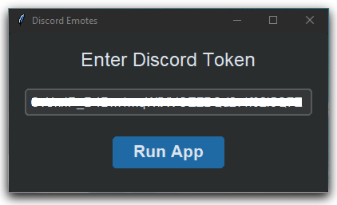
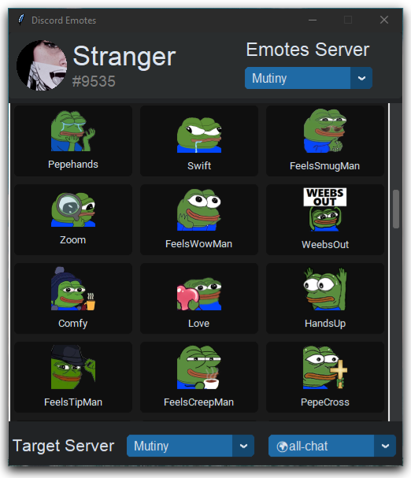

# Discord Emotes

Send discord emotes without nitro

## Description

Simple GUI app to send emotes from all joined servers without nitro

## Getting Started

### Dependencies

* Tkinter ([CustomTkinter-UI](https://github.com/TomSchimansky/CustomTkinter) that was made by [Tom Schimansky](https://github.com/TomSchimansky) to improve the tkinter look)
* multiprocessing
* requests library

### Using the program

The application consist of 2 parts :

* First part will download all the info needed and emotes from all servers by using your auth token( this is a one time thing).

* Second part will be the interface used to selec servers and send emotes.

* On the top side you can pick what server you would like to get emotes from

* On the bottom side you pick what Text Channel you would like to send the emote to by picking the server then the channel

## Help

If you dont know how to get your discord token

you can check this video from [Online Tech Tips](https://www.youtube.com/watch?v=1dva3YqBI2E) on youtube to help you.

## License

This project is licensed under the [MIT] License
